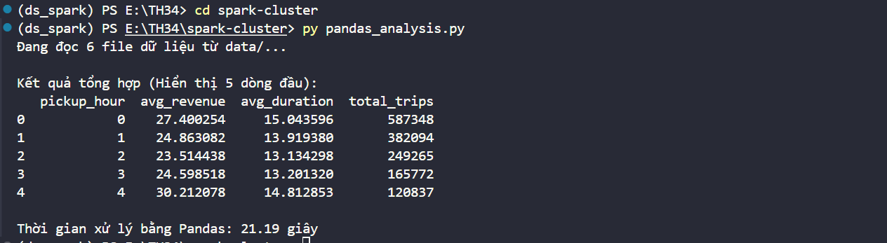
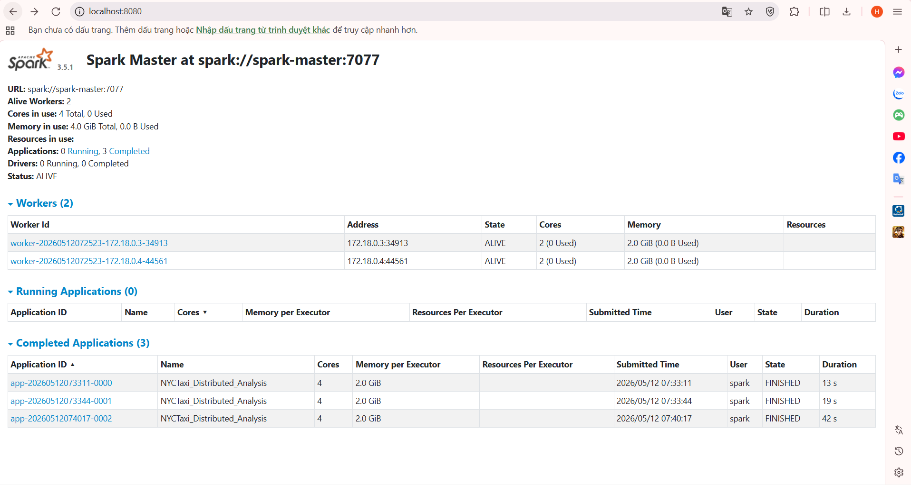

# Dự án Thực hành: So sánh hiệu năng và kiến trúc Pandas với PySpark trên cụm phân tán

Dự án này thuộc chương 3 và 4, nhằm mục đích xây dựng một luồng xử lý dữ liệu tính toán "Doanh thu trung bình và thời gian di chuyển theo từng khung giờ trong ngày" từ bộ dữ liệu Taxi của New York. Qua đó, so sánh thực tế giữa kiến trúc xử lý In-memory của **Pandas** và cơ chế xử lý phân tán (Distributed) của **PySpark**.

## 1. Mục tiêu dự án
*   **Phân biệt kiến trúc:** Hiểu rõ giới hạn In-memory (bộ nhớ trong) của Pandas so với cơ chế Disk/RAM Distributed (phân tán) của Spark.
*   **Khác biệt cơ chế thực thi:** Trải nghiệm sự khác biệt giữa Eager Execution (Thực thi ngay lập tức - Pandas) và Lazy Evaluation (Thực thi lười biếng - PySpark).
*   **Kỹ năng DevOps cơ bản:** Thiết lập cụm máy chủ phân tán (Standalone Cluster). Trong dự án này, thay vì dùng VMware/VirtualBox, **Docker & Docker Compose** đã được sử dụng để tối ưu và hiện đại hóa quá trình triển khai cụm Spark gồm 1 Master và 2 Workers.

## 2. Nguồn dữ liệu
Sử dụng bộ dữ liệu mở NYC TLC Yellow Taxi Trip Records (định dạng Parquet).
*   Nguồn tải: https://www.nyc.gov/site/tlc/about/tlc-trip-record-data.page
*   **Quy mô thực nghiệm trong dự án:** Xử lý 6 tháng dữ liệu (từ tháng 1 đến tháng 6 năm 2024), tương đương khoảng hơn 17 triệu dòng dữ liệu.

## 3. Cài đặt và chạy thử nghiệm (Sử dụng Docker)

### Khởi động Cụm PySpark
Đã cài đặt Docker Desktop. Khởi động cụm Spark (1 Master, 2 Worker) bằng lệnh:
```bash
docker compose up -d
```
Sau khi chạy có thể truy cập Spark Master Web UI tại: `http://localhost:8080`

### Chạy giải pháp Pandas (Local)
Cài đặt thư viện:
```bash
pip install pandas pyarrow
```
Thực thi script:
```bash
python pandas_analysis.py
```

### Chạy giải pháp PySpark (Distributed trên Docker)
Submit công việc lên cụm Spark:
```bash
docker exec spark-master /opt/spark/bin/spark-submit --master spark://spark-master:7077 /tmp/spark_analysis.py
```

## 4. Đánh giá và kết luận (Review & Comparison)

### 4.1. Thu thập số liệu thực tế (Với 6 tháng dữ liệu)
*   Thời gian xử lý bằng **Pandas** (1 luồng CPU): **~21.19 giây**.
    
    *(Ảnh chụp minh họa kết quả Pandas)*
    

*   Thời gian xử lý bằng **PySpark** (Cluster 2 Workers - 4 Cores): **~24.66 giây**. *(Lưu ý: Thời gian thực thi Spark có thể dao động từ 15-45s tùy thuộc vào thời gian khởi tạo network và phân bổ task của Master).*

    *(Ảnh chụp minh họa kết quả PySpark)*
    

### 4.2. Bảng Phân tích So sánh

| Tiêu chí | Pandas | PySpark |
| :--- | :--- | :--- |
| **Bản chất kiến trúc** | Single-node, In-memory (Đơn máy, trong RAM). | Distributed, Disk & RAM (Phân tán trên cụm). |
| **Cơ chế thực thi** | Eager (Tính toán ngay lập tức từng dòng lệnh). | Lazy (Xây dựng kế hoạch, chỉ tính toán khi gọi Action). |
| **Quy mô dữ liệu** | Kích thước dữ liệu phải < Kích thước RAM trống. | Dữ liệu có thể lớn hơn RAM gấp nhiều lần (vài Terabyte). |
| **Độ phức tạp thiết lập** | Đơn giản, `pip install pandas` là xong. | Phức tạp, cần thiết lập Cluster, JVM, Network, cấu hình bộ nhớ (như thiết lập Docker Compose trong dự án). |
| **Khuyến nghị sử dụng**| Phân tích thăm dò, làm sạch dữ liệu nhỏ gọn (Dưới 2GB). | Xử lý ETL định kỳ, phân tích dữ liệu lịch sử khổng lồ. |

### 4.3. Bài học rút ra

**Nhận xét từ số liệu thực tế (Với 6 tháng dữ liệu):**
Qua thực nghiệm với quy mô dữ liệu tầm trung (6 tháng), ta thấy hiệu năng giữa Pandas (21.19s) và PySpark (24.66s) không có sự chênh lệch rõ ràng, thậm chí Pandas chạy có phần nhỉnh hơn. Điều này hoàn toàn phản ánh đúng kiến trúc bên dưới của hai công cụ:

*   **Chi phí khởi tạo (Overhead) của hệ thống phân tán:** PySpark tốn một lượng thời gian đáng kể (vài giây đến hàng chục giây) chỉ để Master lập kế hoạch (DAG) và phân phối tác vụ xuống các Worker. Khi khối lượng tính toán chưa đủ lớn để bù đắp lại "chi phí" này, Spark tỏ ra chậm chạp hơn.  
*   **Điểm tới hạn của Pandas:** Pandas cực kỳ tối ưu và tốc độ trên môi trường RAM đơn máy. Tuy nhiên, nó bị giới hạn vật lý bởi dung lượng RAM.

**Kết luận:** 
Nếu phân tích các tệp dữ liệu có thể fit vừa vào RAM (Small to Medium Data), Pandas luôn là lựa chọn tối ưu về cả thời gian viết code lẫn thời gian thực thi. PySpark chỉ thực sự bộc lộ sức mạnh thống trị (chia để trị) khi khối lượng dữ liệu vượt mức RAM cho phép (Big Data), lúc mà Pandas sẽ bị văng lỗi bộ nhớ (MemoryError) hoặc treo máy.
## 5. Kết quả Thực nghiệm

Dưới đây là ảnh chụp màn hình chứng minh thời gian thực thi của cả hai phương pháp trên 6 tháng dữ liệu:

### Hiệu năng của Pandas


### Hiệu năng của PySpark (Cluster 2 Workers)
